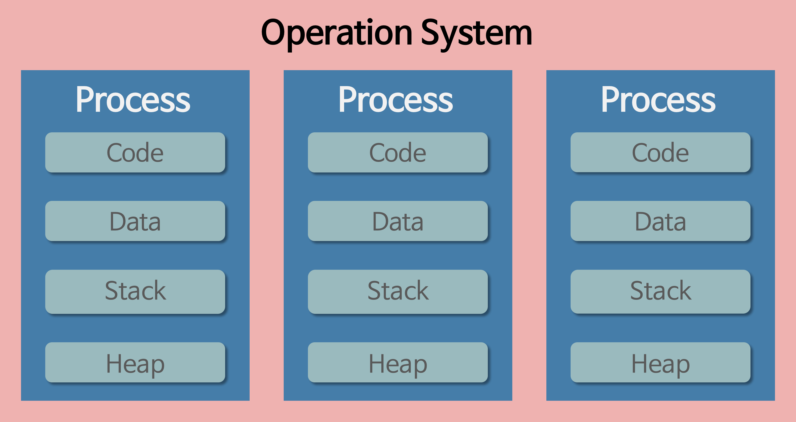
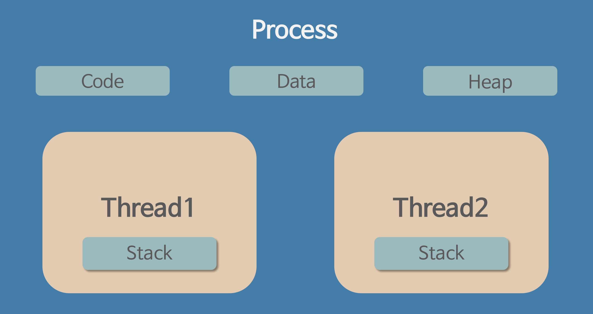

# 자바 동시성, 멀티 쓰레드 관련

자바에서 동시성, 멀티 쓰레드 관련 정리

## 프로세스와 스레드

먼저 프로세스와 스레드에 대해 알아보자

### 프로세스란?

> 컴퓨터에서 실행되고 있는 컴퓨터 프로그램.

OS에서 메모리를 할당 받아 실행 중인 프로그램이라고 보면 된다.

OS로부터 시스템 리소스를 할당 받는 작업의 단위로도 쓰인다 

할당 받는 시스템 자원은 
* CPU 
* 운영되기 위한 필요한 주소 공간 (?)
  * 시스템에 적재되기 위한 공간으로 보면 될듯하다.
* `Code`, `Data`, `Stack`, `Heap`의 구조로 되어 있는 독립적인 메모리 영역

#### 프로세스 특징

* 프로세스는 각각 독립된 메모리 영역(Code, Data, Stack, Heap의 구조)을 할당받는다.
* 기본적으로 프로세스당 최소 1개의 스레드(메인 스레드)를 가지고 있다.
  * 주로 프로그램이 유지되기 위해, 최소 하나의 쓰레드를 유지한다.
  * 완전한 병렬 프로그램이 현실상 불가능하기에 메인 쓰레드에서 하위 쓰레드를 조작하는 형식
* 각 프로세스는 별도의 주소 공간에서 실행되며, 한 프로세스는 다른 프로세스의 변수나 자료구조에 접근할 수 없다.
* 한 프로세스가 다른 프로세스의 자원에 접근하려면 프로세스 간의 통신(IPC, inter-process communication)을 사용해야 한다.
* Ex. 파이프, 파일, 소켓 등을 이용한 통신 방법 이용

### 쓰레드란?
> 프로세스에서 실행되는 여러 흐름의 단위

프로세스가 수행하는 프로그램의 특정 수행 경로

프로세스가 할당받은 자원을 이용하는 실행의 단위

#### 쓰레드 특징

* 스레드는 프로세스 내에서 각각 Stack만 따로 할당받고 Code, Data, Heap 영역은 공유한다.
* 스레드는 한 프로세스 내에서 동작되는 여러 실행의 흐름으로, 프로세스 내의 주소 공간이나 자원들(힙 공간 등)을 같은 프로세스 내에 스레드끼리 공유하면서 실행된다.
* 같은 프로세스 안에 있는 여러 스레드들은 같은 힙 공간을 공유한다. 반면에 프로세스는 다른 프로세스의 메모리에 직접 접근할 수 없다.
* 각각의 스레드는 별도의 레지스터와 스택을 갖고 있지만, 힙 메모리는 서로 읽고 쓸 수 있다.
* 한 스레드가 프로세스 자원을 변경하면, 다른 이웃 스레드(sibling thread)도 그 변경 결과를 즉시 볼 수 있다.

#### 자바, JVM에서 쓰레드란?

* 일반 스레드와 거의 차이가 없으며, JVM가 운영체제의 역할을 한다.
* 자바에는 프로세스가 존재하지 않고 스레드만 존재하며, 자바 스레드는 JVM에 의해 스케줄되는 실행 단위 코드 블록이다.
* 자바에서 스레드 스케줄링은 전적으로 JVM에 의해 이루어진다.
* 아래와 같은 스레드와 관련된 많은 정보들도 JVM이 관리한다.
  * 스레드가 몇 개 존재하는지
  * 스레드로 실행되는 프로그램 코드의 메모리 위치는 어디인지
  * 스레드의 상태는 무엇인지
  * 스레드 우선순위는 얼마인지
* 즉, 개발자는 자바 스레드로 작동할 스레드 코드를 작성하고, 스레드 코드가 생명을 가지고 실행을 시작하도록 JVM에 요청하는 일 뿐이다.

---
# 참조

* [프로세스와 스레드의 차이](https://gmlwjd9405.github.io/2018/09/14/process-vs-thread.html)
  * 잘 정리되어, 따로 정리할 필요없이 이 내용만 봐도 무방할듯...