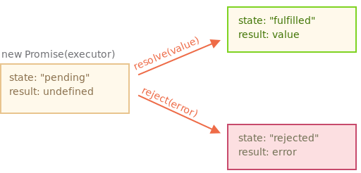
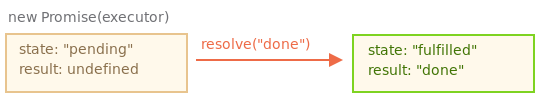
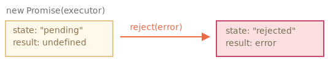

# 프로미스

`promise` 객체는 아래와 같은 문법으로 만들 수 있습니다.

```javascript
let promise1 = new Promise((resolve, reject)=>{ ... });
let promise2 = new Promise.resolve(param);
let promise3 = new Promise.reject(param);
```

`new Promise`에 전달되는 함수는 executor(실행자, 실행 함수) 라고 부른다.

executor는 `new Promise`가 만들어질 때 자동으로 실행되는데, 결과를 최종적으로 만들어내는 제작 코드를 포함한다.

executor의 인수 `resolve`와 `reject`는 자바스크립트에서 자체 제공하는 콜백입니다. 

개발자는 `resolve`와 `reject`를 신경 쓰지 않고 executor 안 코드만 작성하면 됩니다.

대신 executor에선 결과를 즉시 얻든 늦게 얻든 상관없이 상황에 따라 인수로 넘겨준 콜백 중 하나를 반드시 호출해야 한다.

* `resolve(value)` — 일이 성공적으로 끝난 경우 그 결과를 나타내는 `value`와 함께 호출
* `reject(error)` — 에러 발생 시 에러 객체를 나타내는 `error`와 함께 호출

요약하자면 executor는 자동으로 실행되는데 여기서 원하는 일이 처리된다. 

처리가 끝나면 executor는 처리 성공 여부에 따라 `resolve`나 `reject`를 호출한다.

한편, `new Promise` 생성자가 반환하는 `promise` 객체는 다음과 같은 내부 프로퍼티를 갖는다.

* `state`
  * 처음엔 `pending`(보류)이었다 `resolve`가 호출되면 `fulfilled`, `reject`가 호출되면 `rejected`로 변한다..
* `result`
  * 처음엔 `undefined`이었다 `resolve(value)`가 호출되면 `value`로, `reject(error)`가 호출되면 `error`로 변한다.

따라서 executor는 아래 그림과 같이 `promise`의 상태를 둘 중 하나로 변화시킨다.



예시와 함께 알아보자

```javascript
let promise = new Promise(function(resolve, reject){
    console.log(`프로미스 실행!`);

    setTimeout(()=>resolve("done"), 1000);
});
```
executor는 `new Promise`에 의해 자동으로 그리고 즉각적으로 호출된다.

1. executor는 인자로 `resolve`와 `reject` 함수를 받는다. 
2. 이 함수들은 자바스크립트 엔진이 미리 정의한 함수이므로 개발자가 따로 만들 필요가 없다. 

다만, `resolve`나 `reject` 중 하나는 반드시 호출해야 한다.

예시로 작성된 프로미스는 

executor '처리’가 시작 된 지 1초 후, `resolve("done")`이 호출되고 결과가 만들어집니다. 이때 promise 객체의 상태는 다음과 같이 변한다.



이처럼 일이 성공적으로 처리되었을 때의 프로미스는 

`fulfilled promise(약속이 이행된 프로미스)`라고 불린다.

`reject`가 호출되는 경우

```javascript
let promise = new Promise(function(resolve, reject)){
    console.log(`프로미스 실행!`);

    setTimeout(()=>reject(new Error(`에러 발생!`)), 1000);
});
```

1초 후 `reject(...)` 호출되면 `promise`의 상태가 `rejected`로 변한다.



정리하자면 executor는 보통 시간이 걸리는 일을 수행한다. 

일이 끝나면 `resolve`나 `reject` 함수를 호출하는데, 

이때 프로미스 객체의 상태가 변화합니다.

이행(`resolved`) 혹은 거부(`rejected`) 상태의 프로미스는 `처리된(settled)` 프로미스라고 부른다. 

반대되는 프로미스로 `대기(pending)`상태의 프로미스가 있습니다.

프로미스의 상태는 총 세개의 상태를 가진다.

* 대기 - `pending`
* 성공 - `fulfilled` , `resolved`
* 실패 - `rejected`

## then, catch, finally

프로미스 객체는 executor와 결과나 에러를 받을 소비 함수를 이어주는 역할을 한다. 

소비함수는 `.then`, `.catch`, `.finally` 메서드를 사용해 등록된다.

### then

`.then`은 프로미스에서 가장 중요하고 기본이 되는 메서드.

문법은 다음과 같다.

```javascript
promise.then(
    function(result) { ... }, // 결과를 다룬다.
    function(resolve) { ... } // 에러를 다룬다.
)
```
`.then`의 첫 번째 인수는 프로미스가 이행되었을 때 실행되는 함수이고, 여기서 실행 결과를 받습니다.

`.then`의 두 번째 인수는 프로미스가 거부되었을 때 실행되는 함수이고, 여기서 에러를 받습니다.

성공적으로 이행된 프로미스 예시

```javascript
let promise = new Promise(function(resolve, reject) {
  setTimeout(() => resolve("done!"), 1000);
});

// resolve 함수는 .then의 첫 번째 함수(인수)를 실행합니다.
promise.then(
  result => console.log(result), // 1초 후 "done!"을 출력
  error => console.log(error) // 실행되지 않음
);
```

프로미스가 거부됬을 경우

```javascript
let promise = new Promise(function(resolve, reject) {
  setTimeout(() => reject(new Error("에러 발생!")), 1000);
});

// reject 함수는 .then의 두 번째 함수를 실행합니다.
promise.then(
  result => console.log(result), // 실행되지 않음
  error => console.log(error) // 1초 후 "Error: 에러 발생!"를 출력
);
```

성공한 경우만 처리할 경우 `.then`에 인수 하나만 전달

```javascript
let promise = new Promise(resolve => {
  setTimeout(() => resolve("done!"), 1000);
});

promise.then(console.log); // 1초 뒤 "done!" 출력
```

### catch

에러가 발생한 경우만 다루고 싶다면  
`.then(null, errorHandlingFunction)`같이 `null`을 첫 번째 인수로 전달하면 된다.

`.catch(errorHandlingFunction)`를 써도 되는데,   
`.catch`는 `.then`에 `null`을 전달하는 것과 동일하게 작동한다.

```javascript
let promise = new Promise((resolve, reject) => {
  setTimeout(() => reject(new Error("에러 발생!")), 1000);
});

// .catch(f)는 promise.then(null, f)과 동일하게 작동합니다
promise.catch(console.log); // 1초 뒤 "Error: 에러 발생!" 출력
```

`.catch(f)`는 문법이 간결하다는 점만 빼고 `.then(null,f)`과 완벽하게 같다.

### finally

`try {...} catch {...}`에 `finally` 절이 있는 것처럼, 프로미스에도 `finally`가 있다.

프로미스가 처리되면(이행이나 거부) `f`가 항상 실행된다는 점에서 `.finally(f)` 호출은 `.then(f, f)`과 유사하다.

쓸모가 없어진 `로딩 인디케이터(loading indicator)`를 멈추는 경우같이,  
결과가 어떻든 마무리가 필요하면 `finally`가 유용하다.

```javascript
new Promise((resolve, reject) => {
  /* 시간이 걸리는 어떤 일을 수행하고, 그 후 resolve, reject를 호출함 */
})
  // 성공·실패 여부와 상관없이 프로미스가 처리되면 실행됨
  .finally(() => 로딩 인디케이터 중지)
  .then(result => result와 err 보여줌 => error 보여줌)
```

그런데 `finally`는 `.then(f, f)`과 완전히 같진 않다. 

차이점은 다음과 같습니다.

1. `finally` 핸들러엔 인수가 없습니다.  
   * `finally`에선 프로미스가 이행되었는지, 거부되었는지 알 수 없습니다. 
   * `finally`에선 절차를 마무리하는 `보편적` 동작을 수행하기 때문에 성공·실패 여부를 몰라도 됩니다.
2. `finally` 핸들러는 자동으로 다음 핸들러에 결과와 에러를 전달합니다.  

`finally` 를 거쳐 `then`까지 전달   
```javascript
   new Promise((resolve, reject) => {
  setTimeout(() => resolve("결과"), 2000)
})
  .finally(() => console.log("프로미스가 준비되었습니다."))
  .then(result => console.log(result)); // <-- .then에서 result를 다룰 수 있음
```

`finally` 를 거쳐 `catch`까지 전달

```javascript
new Promise((resolve, reject) => {
  throw new Error("에러 발생!");
})
  .finally(() => console.log("프로미스가 준비되었습니다."))
  .catch(err => console.log(err)); // <-- .catch에서 에러 객체를 다룰 수 있음
```
`finally`는 프로미스 결과를 처리하기 위해 만들어 진 게 아닙니다. 

프로미스 결과는 `finally`를 통과해서 전달되죠.  
이런 특징은 아주 유용하게 사용되기도 합니다.
3. `.finally(f)`는 함수 `f`를 중복해서 쓸 필요가 없기 때문에 `.then(f, f)`보다 문법 측면에서 더 편리

> 처리된 프로미스의 핸들러는 즉각 실행됩니다.  
> 프로미스가 대기 상태일 때, `.then/catch/finally` 핸들러는 프로미스가 처리되길 기다립니다.  
> 
> 반면, 프로미스가 이미 처리상태라면 핸들러가 즉각 실행됩니다.

```javascript
// 아래 프로미스는 생성과 동시에 이행됩니다.
let promise = new Promise(resolve => resolve("완료!"));

promise.then(alert); // 완료! (바로 출력됨)
```

# callback vs promise

|  Promise(프로미스)  |  callback(콜백)  |
| :------------------- | :---------------- |
|프로미스를 이용하면 흐름이 자연스럽다. `asyncMethod(script)`로 스크립트를 읽고, 결과에 따라 그다음(`.then`)에 무엇을 할지에 대한 코드를 작성하면 된다.|`asyncMethod(script, callback)`를 호출할 때, 함께 호출할 `callback` 함수가 준비되어 있어야 합니다. `asyncMethod`를 호출하기 이전에 호출 결과로 무엇을 할지 미리 알고 있어야 합니다.|
| 프로미스에 원하는 만큼 `.then`을 호출할 수 있습니다. | 콜백은 하나만 가능합니다.|

간단히 요약하자면 콜백으로 생성된 비동기 함수에 비해

__흐름이 자연스럽고 유연한 코드를 작성할 수 있다.__