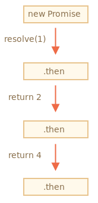
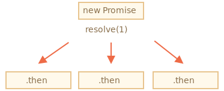
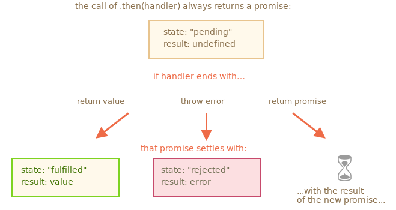

# 프로미스 체이닝

프로미스 체이닝 구조

```javascript
new Promise(function(resolve, reject) {

  setTimeout(() => resolve(1), 1000); // (*)

}).then(function(result) { // (**)

  console.log(result); // 1
  return result * 2;

}).then(function(result) { // (***)

  console.log(result); // 2
  return result * 2;

}).then(function(result) {

  console.log(result); // 4
  return result * 2;

});
```

프로미스 체이닝은 `result`가 `.then` 핸들러의 체인(사슬)을 통해 전달된다는 점에서 착안한 아이디어.

위 예시는 아래와 같은 순서로 실행된다.

1. 1초 후 최초 프로미스가 이행된다. – `(*)`
2. 이후 첫번째 `.then` 핸들러가 호출된다. – `(**)`
3. 2에서 반환한 값은 다음 `.then` 핸들러에 전달된다. – `(***)`
4. 이런 과정이 계속 이어진다.



프로미스 체이닝이 가능한 이유는

`promise.then`을 호출하면 프로미스가 반환되기 때문. 

반환된 프로미스엔 당연히 `.then`을 호출할 수 있다.

한편 핸들러가 값을 반환할 때엔 이 값이 프로미스의 `result`가 된다. 

따라서 다음 `.then`은 이 값을 이용해 호출된다.

초보자는 프로미스 하나에 `.then`을 여러 개 추가한 후, 

이를 체이닝이라고 착각하는 경우가 있다. **하지만 이는 체이닝이 아닙니다.**

```javascript
let promise = new Promise(function(resolve, reject) {
  setTimeout(() => resolve(1), 1000);
});

promise.then(function(result) {
  console.log(result); // 1
  return result * 2;
});

promise.then(function(result) {
  console.log(result); // 1
  return result * 2;
});

promise.then(function(result) {
  console.log(result); // 1
  return result * 2;
});
```
예시의 프로미스는 하나인데 여기에 등록된 핸들러는 여러 개. 

이 핸들러들은 `result`를 순차적으로 전달하지 않고 독립적으로 처리한다.



동일한 프로미스에 등록된 `.then` 모두는 동일한 결과(프로미스의 `result`)를 받는다. 

따라서 위 예시를 실행하면 콘솔 창엔 전부 `1`이 출력된다.

이런 식으로 한 프로미스에 여러 개의 핸들러를 등록해서 사용하는 경우는 거의 없다. **프로미스는 주로 체이닝을 해서 쓴다.**

## 프로미스 반환

`.then(handler)`에 사용된 핸들러가 프로미스를 생성하거나 반환하는 경우도 있다.

이 경우 이어지는 핸들러는 프로미스가 처리될 때까지 기다리다가 처리가 완료되면 그 결과를 받는다.

```javascript
new Promise(function(resolve, reject) {

  setTimeout(() => resolve(1), 1000);

}).then(function(result) {

  console.log(result); // 1

  return new Promise((resolve, reject) => { // (*)
    setTimeout(() => resolve(result * 2), 1000);
  });

}).then(function(result) { // (**)

  console.log(result); // 2

  return new Promise((resolve, reject) => {
    setTimeout(() => resolve(result * 2), 1000);
  });

}).then(function(result) {

  console.log(result); // 4

});
```

예시에서 첫 번째 `.then`은 `1`을 출력하고 `new Promise(…)`를 반환(`(*)`)한다.

1초 후 이 프로미스가 이행되고 그 결과(`resolve`의 인수인 `result * 2`)는 두 번째 `.then`으로 전달된다. 

두 번째 핸들러(`(**)`)는 `2`를 출력하고 동일한 과정이 반복된다.

따라서 콘솔 창엔 이전 예시와 동일하게 `1`, `2`, `4`가 차례대로 출력된다. 

다만 콘솔 창 사이에 1초의 딜레이가 생긴다.

이렇게 핸들러 안에서 프로미스를 반환하는 것도 비동기 작업 체이닝을 가능하게 해준다.

## thenable

핸들러는 프로미스가 아닌 `thenable`이라 불리는 객체를 반환하기도 한다. 

`.then`이라는 메서드를 가진 객체는 모두 `thenable`객체라고 부르는데, 이 객체는 프로미스와 같은 방식으로 처리된다.

`thenable` 객체에 대한 아이디어는 서드파티 라이브러리가 `프로미스와 호환 가능한` 자체 객체를 구현할 수 있다는 점에서 나왔다. 

이 객체들엔 자체 확장 메서드가 구현되어 있겠지만 `.then`이 있기 때문에 네이티브 프로미스와도 호환 가능하다.

```javascript
class Thenable {
  constructor(num) {
    this.num = num;
  }
  then(resolve, reject) {
    console.log(resolve); // function() { 네이티브 코드 }
    // 1초 후 this.num*2와 함께 이행됨
    setTimeout(() => resolve(this.num * 2), 1000); // (**)
  }
}

new Promise(resolve => resolve(1))
  .then(result => {
    return new Thenable(result); // (*)
  })
  .then(console.log); // 1000밀리 초 후 2를 보여줌
```

자바스크립트는 `(*)`로 표시한 줄에서 `.then` 핸들러가 반환한 객체를 확인한다. 

이 객체에 호출 가능한 메서드 `then`이 있으면 `then`이 호출된다. 

`then`은 `resolve`와 `reject`라는 네이티브 함수를 인수로 받고(executor과 유사함), 둘 중 하나가 호출될 때까지 기다린다. 

위 예시에서 `resolve(2)`는 1초 후에 호출됩니다(`(**)`). 

호출 후 결과는 체인을 따라 아래로 전달된다.

이런 식으로 구현하면 `Promise`를 상속받지 않고도 커스텀 객체를 사용해 프로미스 체이닝을 만들 수 있다.

## fetch와 프로미스 체이닝

네트워크 요청 시 프로미스를 자주 사용합니다. 이에 관련된 예시

```javascript
let fetchApi = fetch(url);
```
위 스크립트를 실행하면 `url`에 네트워크 요청을 보내고 프로미스를 반환한다.

원격 서버가 헤더와 함께 응답을 보내면, 프로미스는 `response` 객체와 함께 이행된다.

하지만 ___response 전체가 다운로드되기전에 프로미스는 이행상태가 되버린다.___ 

응답이 완전히 종료되고, 응답 전체를 읽으려면 메서드 `response.text()`를 호출해야 한다. 

`response.text()`는 원격 서버에서 전송한 텍스트 전체가 다운로드되면, 이 텍스트를 `result` 값으로 갖는 이행된 프로미스를 반환한다.

```javascript
fetch('https://reqres.in/api/users')
    // 원격 서버가 응답하면 .then 아래 코드 실행됨.
    .then(function(response){
        // response.text()는 응답 텍스트 전체가 다운로드되면
        // 응답 테스트를 새로운 프로미스로 만들고, 이를 반환한다.
        return response.text();
    })
    .then(function(text){
        // 원격에서 받아온 내용
        console.log(text);
    });
```

```javascript
// 위 코드와 동일한 기능이지만, response.json()을 통해 불러온 내용을 JSON으로 변환
fetch('https://reqres.in/api/users')
    .then((res)=>res.json())
    .then(console.log);
```

비동기 동작은 항상 프로미스를 반환하도록 하는 것이 좋다. 

지금은 체인을 확장할 계획이 없더라도 이렇게 구현해 놓으면 나중에 체인 확장이 필요한 경우 손쉽게 체인을 확장할 수 있다.

## 정리

`.then` 또는 `.catch`, `.finally`의 핸들러(어떤 경우도 상관없음)가 프로미스를 반환하면, 나머지 체인은 프로미스가 처리될 때까지 대기합니다. 

처리가 완료되면 프로미스의 `result`(값 또는 에러)가 다음 체인으로 전달됩니다.

