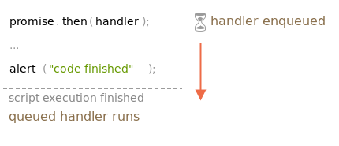

# 마이크로태스크

프로미스 핸들러 `.then/catch/finally`는 항상 비동기적으로 실행됩니다.

프로미스가 즉시 이행되더라도 `.then/catch/finally` 아래에 있는 코드는 이 핸들러들이 실행되기 전에 실행됩니다.

```javascript
let promise = Promise.resolve();

promise.then(()=>console.log("프로미스 성공!"));

console.log("종료..."); // 이 로그가 먼저 나타남.
```

프로미스가 즉시 이행되었지만 `.then`이 나중에 나타난 이유가 뭘까?

## 마이크로태스크 큐

비동기 작업을 처리하려면 적절한 관리가 필요하다. 

이를 위해 ECMA에선 `PromiseJobs`라는 내부 큐(`internal queue`)를 명시한다. 

V8 엔진에선 이를 `마이크로태스크 큐(microtask queue)`라고 부르기 때문에 이 용어가 좀 더 선호된다.

[명세서](https://tc39.es/ecma262/#sec-jobs-and-job-queues)의 설명을 보자

* 마이크로태스크 큐는 먼저 들어온 작업을 먼저 실행한다
  * (FIFO, first-in-first-out).
* 실행할 것이 아무것도 남아있지 않을 때만 마이크로태스크 큐에 있는 작업이 실행되기 시작한다.

요약하자면, 어떤 프로미스가 준비되었을 때 이 프로미스의 `.then/catch/finally` 핸들러가 큐에 들어간다고 생각하시면 된다. 

이때 핸들러들은 여전히 실행되지 않는다. 
현재 코드에서 자유로운 상태가 되었을 때에서야 자바스크립트 엔진은 큐에서 작업을 꺼내 실행한다.

위 예시에서 `종료...`가 먼저 출력되는 이유가 여기에 있다.



프로미스 핸들러는 항상 내부 큐를 통과하게 된다.

여러 개의 `.then/catch/finally`를 사용해 만든 체인의 경우

각 핸들러는 비동기적으로 실행된다.  
큐에 들어간 핸들러 각각은 현재 코드가 완료되고, 큐에 적체된 이전 핸들러의 실행이 완료되었을 때 실행된다.

그렇다면 `프로미스 성공!`을 먼저, `종료...`를 나중에 출력되게 하려면 어떻게 해야 할까? 

실행 순서가 중요한 경우엔 이런 요구사항이 충족되도록 코드를 작성해야 한다.

방법은 아주 쉬운데, `.then`을 사용해 큐에 넣으면 된다.

```javascript
Promise.resolve()
    .then(()=> console.log("프로미스 성공!"))
    .then(()=> console.log("종료..."));
```

## 처리되지 못한 거부

’처리되지 못한 거부’는 마이크로태스크 큐 끝에서 프로미스 에러가 처리되지 못할 때 발생합니다.

정상적인 경우라면 개발자는 에러가 생길 것을 대비하여 프로미스 체인에 .catch를 추가해 에러를 처리합니다.

```javascript
import process from 'process';

Promise.reject(new Error("프로미스 실패!"))
    .catch(err=> console.log(err)); 

// 에러가 잘 처리되어 실행되지 않음.
process.on('unhandledRejection', (reason, promise) => {    
    console.log('Unhandled Rejection at:', promise, 'reason:', reason);
});
```

`.catch`로 처리해주지 못한 경우

**엔진은 마이크로태스크 큐가 비워진 이후에 `unhandledRejection` 이벤트를 트리거 한다.**

```javascript
import process from 'process';

Promise.reject(new Error("프로미스 실패!"))
// .catch(err=> console.log(err)); 

// 에러가 처리되지 않아 해당 이벤트 트리거됨
process.on('unhandledRejection', (reason, promise) => {    
    console.log('Unhandled Rejection at:', promise, 'reason:', reason);
});
```

`.catch`를 나중에 처리하게 되면 해당 이벤트를 막을 수 있을까?

```javascript
import process from 'process';

let promise = Promise.reject(new Error("프로미스 실패!"));
setTimeout(()=> promise.catch(err=>console.log("처리됨")),1000);
    
process.on('unhandledRejection', (reason, promise) => {    
    console.log('Unhandled Rejection at:', promise, 'reason:', reason);
});
```

이벤트가 트리거되어 로그에 찍힌 후에 `.catch` 가 처리한다.

`unhandledrejection`은 마이크로태스크 큐에 있는 작업 모두가 완료되었을 때 생성된다. 

엔진은 프로미스들을 검사하고 이 중 하나라도 `거부(rejected)` 상태이면 `unhandledrejection` 핸들러를 트리거 한다.

위 예시를 실행하면 `setTimeout`을 사용해 추가한 `.catch` 역시 트리거 되지만

`.catch`는 `unhandledrejection`이 발생한 이후에 트리거 되므로 `프로미스 실패!`가 출력된다.

# 정리

모든 프로미스 동작은 `마이크로태스크 큐`라 불리는 내부 `프로미스 잡(promise job)` 큐에 들어가서 처리되기 때문에 프로미스 핸들링은 항상 비동기로 처리된다.

따라서 `.then/catch/finally` 핸들러는 항상 현재 코드가 종료되고 난 후에 호출된다.

어떤 코드 조각을 `.then/catch/finally`가 호출된 이후에 실행하고 싶다면 `.then`을 체인에 추가하고 이 안에 코드 조각을 넣으면 된다.

브라우저와 `Node.js`를 포함한 대부분의 자바스크립트 엔진에선, 마이크로태스크가 `이벤트 루프(event loop)`와 `매크로태스크(macrotask)`와 깊은 연관 관계를 맺는다.