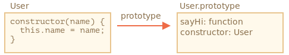

# 클래스

> 클래스는  
> 객체 지향 프로그래밍에서 특정 객체를 생성하기 위해 
> `변수`와 `메소드`를 정의하는 일종의 틀로
> 
> 객체를 정의하기 위한 상태(`멤버 변수`)와 메서드(`함수`)로 구성

자바스크립트에서 동일한 종류의 객체를 생성해야 할 때

`new function` 을 통해 생성할 수 있다.

여기에 `class`를 사용하면 객체지향 프로그래밍에서 사용되는 다양한 기능을 사용할 수 있다.

## 기본 문법

```typescript
class MyClass {
    constructor() { ... }
    method1() { ... }
    method2() { ... }
    method3() { ... }
}
```
이렇게 클래스 만들고, `new MyClass()` 호출하면 내부에서 정의한 메서드가 들어 있는  객체가 생성된다.

객체의 기본 상태를 설정해주는 생성자 메서드 `constructor()`는 `new`에 의해 자동 호출되어

특별한 절차 없이 객체를 초기화할 수 있다.

```javascript
class User {
    constructor(name) {
        this.name = name;
    }

    introduce() {
        console.log(this.name);
    }
}

let user = new User("홍길동");
user.introduce();
```

`new User("홍길동")`를 호출시 일어나는 일

1. 새로운 객체가 생성
2. 넘겨받은 인수(`홍길동`)과 함께 `constructor`가 자동으로 실행  
   이때 인수 `홍길동`이 `this.name`에 할당된다.

이 과정 이후에 `user.introduce()` 같은 객체 메서드를 호출할 수 있다.

클래스에는 객체 리터럴 표기법과 다르게 메서드 사이에 쉼표를 넣지 않아도 된다.

## 클래스란?

클래스는 자바스크립트에서 새롭게 창안한 개체(`entity`)가 아니다.

**자바스크립트에서 클래스는 함수의 한 종류입니다.**

```javascript
class User {
  constructor(name) { this.name = name; }
  introduce() { console.log(this.name); }
}

// User가 함수라는 증거
console.log(typeof User); // function
```

`class User {...}` 문법 구조가 진짜 하는 일은 다음과 같다.

`User`라는 이름을 가진 함수를 만든다. 

1. 함수 본문은 생성자 메서드 ``constructor`에서 가져온다.  
생성자 메서드가 없으면 본문이 비워진 채로 함수가 만들어집니다.
2. `introduce`같은 클래스 내에서 정의한 메서드를 `User.prototype`에 저장한다.

`new User`를 호출해 객체를 만들고, 객체의 메서드를 호출하면 함수의 `prototype` 프로퍼티에서 설명한 것처럼 메서드를 프로토타입에서 가져온다. 

이 과정이 있기 때문에 객체에서 클래스 메서드에 접근할 수 있습니다.

`class User` 선언 결과를 그림으로 나타내면 아래와 같습니다.



```javascript
class User {
  constructor(name) { this.name = name; }
  introduce() { alert(this.name); }
}

// 클래스는 함수입니다.
console.log(typeof User); // function

// 정확히는 생성자 메서드와 동일합니다.
console.log(User === User.prototype.constructor); // true

// 클래스 내부에서 정의한 메서드는 User.prototype에 저장됩니다.
console.log(User.prototype.sayHi); // console.log(this.name);

// 현재 프로토타입에는 메서드가 두 개입니다.
console.log(Object.getOwnPropertyNames(User.prototype)); // constructor, introduce
```

## 단순 편의 문법?

어떤 사람들은 `class`라는 키워드 없이도 클래스 역할을 하는 함수를 선언할 수 있기 때문에 클래스는 '편의 문법’에 불과하다고 이야기한다.

```javascript
// class User와 동일한 기능을 하는 순수 함수

// 1. 생성자 함수를 만듭니다.
function User(name) {
  this.name = name;
}
// 모든 함수의 프로토타입은 'constructor' 프로퍼티를 기본으로 갖고 있기 때문에
// constructor 프로퍼티를 명시적으로 만들 필요가 없다.

// 2. prototype에 메서드를 추가.
User.prototype.introduce = function() {
  console.log(this.name);
};

// 사용법:
let user = new User("John");
user.introduce();
```

위 예시처럼 순수 함수로 클래스 역할을 하는 함수를 선언하는 방법과 `class` 키워드를 사용하는 방법의 결과는 거의 같다. 

`class`가 단순한 편의 문법이라고 생각하는 이유가 여기에 있다.

그런데 두 방법에는 중요한 차이가 몇 가지 있다.

1. `class`로 만든 함수엔 특수 내부 프로퍼티인 `[[FunctionKind]]:"classConstructor"`가 이름표처럼 붙는다. 

이것만으로도 두 방법엔 분명한 차이가 있음을 알 수 있다.

자바스크립트는 다양한 방법을 사용해 함수에 `[[FunctionKind]]:"classConstructor"`가 있는지를 확인한다. 

이런 검증 과정이 있기 때문에 클래스 생성자를 `new`와 함께 호출하지 않으면 에러가 발생한다.

```javascript
class User {
    constructor() {}
}

console.log(typeof User);
User(); // TypeError: Class constructor User cannot be invoked without 'new'
```

대부분의 자바스크립트 엔진이 클래스 생성자를 문자열로 표현할 때 `'class…'`로 시작하는 문자열로 표현한다는 점 역시 다르다.

```javascript
class User {
    constructor() {}
}

console.log(User); // class User { ... }
```
2. 클래스 메서드는 열거할 수 없습니다(`non-enumerable`).  
   클래스의 `prototype` 프로퍼티에 추가된 메서드 전체의 `enumerable` 플래그는 `false`입니다.

`for..in`으로 객체를 순회할 때, 메서드는 순회 대상에서 제외하고자 하는 경우가 많으므로 이 특징은 꽤 유용합니다.

## 클래스 표현식

함수처럼 클래스도 다른 표현식 내부에서 정의, 전달, 반환, 할당할 수 있다.

```javascript
let User = class {
    introduce() {
        console.log("Hello");
    }
}
```

기명 함수 표현식(`Named Function Expression`)과 유사하게 클래스 표현식에도 이름을 붙일 수 있다.

클래스 표현식에 이름을 붙이면, 이 이름은 오직 클래스 내부에서만 사용할 수 있다.

```javascript
// 기명 클래스 표현식(Named Class Expression)
// (명세서엔 없는 용어이지만, 기명 함수 표현식과 유사하게 동작한다.)
let User = class MyClass {
  introduce() {
    console.log(MyClass); // MyClass라는 이름은 오직 클래스 안에서만 사용할 수 있다.
  }
};

new User().introduce(); // 제대로 동작(MyClass의 정의를 보여줌).

console.log(MyClass); // ReferenceError: MyClass is not defined, MyClass는 클래스 밖에서 사용할 수 없다.
```

**필요에 따라** 클래스를 동적으로 생성하는 것도 가능하다.

```javascript
function makeClass(word){
    return class {
        say() {
            console.log(word);
        }
    }
}

let User = makeClass("클래스");
new User().say(); // "클래스"
```

## getter 와 setter

리터럴을 사용해 만든 객체처럼 클래스도 `getter`나 `setter`

계산된 프로퍼티(`computed property`)를 포함할 수 있다.

```javascript
class User {
    constructor(name){
        this.name = name;
    }

    get name() {
        return this._name;
    }

    set name(value) {
        if(value.length < 4) {
            console.error("이름이 너무 짧습니다.");
            return;
        }
        this._name = value;
    }
}

let user = new User("4word");
console.log(user.name);

user = new User(""); // 이름이 너무 짧습니다.
```

클래스를 선언하면 `User.prototype`에 `getter`와 `setter`가 만들어지므로 `get`과 `set`을 사용할 수 있다.

## 계산된 메서드 이름 `[...]`

대괄호 `[...]`를 이용해 계산된 메서드 이름(`computed method name`)을 만드는 예시

```javascript
class User {
    ['computed'+'method']() {
        console.log("계산된 메서드 이름");
    }
}

new User().computedmethod();
```

## 클래스 필드

`클래스 필드(class field)` 문법을 사용하면 어떤 종류의 프로퍼티도 클래스에 추가할 수 있다.

```javascript
class User {
    name = "유저";

    introduce() {
        console.log(`Hello, ${this.name}`);
    }
}

new User().introduce(); // Hello, 유저
```

클래스를 정의할 때 `'<프로퍼티 이름> = <값>'`을 써주면 간단히 클래스 필드를 만들 수 있다.

클래스 필드의 중요한 특징 중 하나는 `User.prototype`이 아닌 개별 객체에만 클래스 필드가 설정된다는 점.

```javascript
class User {
  name = "유저";
}

let user = new User();
console.log(user.name); // 유저
console.log(User.prototype.name); // undefined
```

클래스 필드엔 복잡한 표현식이나 함수 호출 결과를 사용할 수 있습니다.

```javascript
function someFunc(){
    return "유저";
}
class User {
    name = someFunc();
}
let user = new User();
console.log(user.name);
```

## 클래스 필드로 바인딩된 메서드

자바스크립트의 함수는 동적인 `this`를 갖습니다.

따라서 객체 메서드를 여기저기 전달해 전혀 다른 컨텍스트에서 호출하게 되면 `this`는 원래 객체를 참조하지 않습니다.

```javascript
class Button {
  constructor(value) {
    this.value = value;
  }

  click() {
    console.log(this.value);
  }
}

let button = new Button("버튼");

setTimeout(button.click, 1000); // undefined
```

이렇게 `this`의 컨텍스트를 알 수 없게 되는 문제를 `잃어버린 this(losing this)`라고 한다.

이를 해결하기 위한 두가지 방법이 있는데

1. `setTimeout(()=> button.click(), 1000) 같이 래퍼함수로 전달하기
2. 생성자 안 등, 메서드를 객체에 바인딩하기

클래스 필드는 다른 방법을 제공한다.

```javascript
class Button {
  constructor(value) {
    this.value = value;
  }
  click = () => {
    console.log(this.value);
  }
}

let button = new Button("버튼");

setTimeout(button.click, 1000); // hello
```

클래스 필드 `click = () => {...}`는 

각 `Button` 객체마다 독립적인 함수를 만들고 함수의 `this`를 해당 객체에 바인딩시켜준다. 

따라서 개발자는 `button.click`을 아무 곳에나 전달할 수 있고, `this`엔 항상 의도한 값이 들어가게 된다.

# 정리

자바스크립트의 클래스 문법

```javascript
class MyClass {
  prop = value; // 프로퍼티

  constructor(...) { // 생성자 메서드
    // ...
  }

  method(...) {} // 메서드

  get something(...) {} // getter 메서드
  set something(...) {} // setter 메서드

  [Symbol.iterator]() {} // 계산된 이름(computed name)을 사용해 만드는 메서드 (심볼)
  // ...
}
```

`MyClass`는 `constructor`의 코드를 본문으로 갖는 함수. 

`MyClass`에서 정의한 일반 메서드나 `getter`, `setter`는 `MyClass.prototype`에 쓰인다.