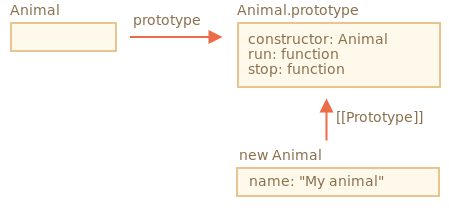
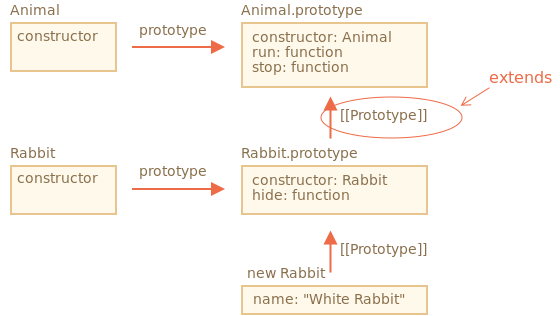
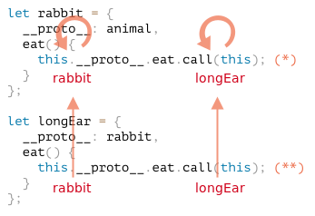

# 클래스 상속

클래스 상속을 사용하면 클래스를 다른 클래스로 확장할 수 있다.

기존 존재하는 기능을 토대로 새로운 기능을 만들 수 있다.

## `extends` 키워드

```javascript
class Animal {
  constructor(name) {
    this.speed = 0;
    this.name = name;
  }
  run(speed) {
    this.speed = speed;
    console.log(`${this.name} 은/는 속도 ${this.speed}로 달립니다.`);
  }
  stop() {
    this.speed = 0;
    console.log(`${this.name} 이/가 멈췄습니다.`);
  }
}

let animal = new Animal("동물");
```

객체 `animal` 과 클래스 `Animal`의 관계



`Animal`을 상속한 `Rabbit` 예시

```javascript
class Rabbit extends Animal {
  hide() {
    console.log(`${this.name} 이/가 숨었습니다!`);
  }
}

let rabbit = new Rabbit("흰 토끼");

rabbit.run(5); // 흰 토끼 은/는 속도 5로 달립니다.
rabbit.hide(); // 흰 토끼 이/가 숨었습니다!
```

클래스 `Rabbit`을 사용해 만든 객체는 

`rabbit.hide()` 같은 Rabbit에 정의된 메서드에도 접근할 수 있고,  
`rabbit.run()` 같은 Animal에 정의된 메서드에도 접근할 수 있다.

키워드 `extends`는 프로토타입을 기반으로 동작한다. 

`extends`는 `Rabbit.prototype.[[Prototype]]`을 `Animal.prototype`으로 설정한다.

그렇기 때문에 `Rabbit.prototype`에서 메서드를 찾지 못하면 `Animal.prototype`에서 메서드를 가져온다.



엔진은 다음 절차를 따라 메서드 `rabbit.run`의 존재를 확인한다.

1. 객체 `rabbit`에 `run`이 있나 확인. run이 없는 것을 확인
2. `rabbit`의 프로토타입인 `Rabbit.prototype`에 메서드가 있나 확인.  
   `hide`는 있는데 `run`은 없음.
3. `extends`를 통해 관계가 만들어진 `Rabbit.prototype`의 프로토타입  
   `Animal.prototype`에 메서드가 있나 확인. 메서드 `run`을 찾음.

자바스크립트의 내장 객체는 프로토타입을 기반으로 상속 관계를 맺는다.

`Date.prototype.[[Prototype]]`이 `Object.prototype`인 것처럼. 

`Date` 객체에서 일반 객체 메서드를 사용할 수 있는 이유

### `extends` 뒤에 표현식이 올 수도 있다.

클래스 문법은 `extends` 뒤에 표현식이 와도 처리해준다.

```javascript
function f(value){
    return class {
        fun() {
            console.log(value);
        }
    }
}

class User extends f("표현식") {}

new User().fun(); // 표현식
```

`class User`는 `f("Hello")`의 반환 값을 상속받는다.

이 방법은 조건에 따라 다른 클래스를 상속받고 싶을 때 유용하다. 

조건에 따라 다른 클래스를 반환하는 함수를 만들고, 함수 호출 결과를 상속받게 하면 된다.

## 메소드 오버라이딩

특별한 사항이 없으면 `class Rabbit`은 `class Animal`에 있는 메서드를 그대로 상속받는다.

상속하여 구현한 자식 클래스에서 부모 클래스의 메서드의 이름을 그대로 사용하여 구현시

부모의 메소드, 상속 메서드를 사용하지 않고 자체 메소드를 사용한다.

```javascript
class Rabbit extends Animal {
    stop() {
        // rabbit.stop() 호출시
        // Animal.stop()이 아닌, 이 메소드가 사용된다.
    }
}
```

키워드 `super`는 이럴 때 사용합니다.

`super.method(...)`는 부모 클래스에 정의된 메서드, `method`를 호출한다.

`super(...)`는 부모 생성자를 호출하는데, 자식 생성자 내부에서만 사용 할 수 있다.

```javascript
class Animal {

  constructor(name) {
    this.speed = 0;
    this.name = name;
  }

  run(speed) {
    this.speed = speed;
    console.log(`${this.name}가 속도 ${this.speed}로 달립니다.`);
  }

  stop() {
    this.speed = 0;
    console.log(`${this.name}가 멈췄습니다.`);
  }

}

class Rabbit extends Animal {
  hide() {
    console.log(`${this.name}가 숨었습니다!`);
  }

  stop() {
    super.stop(); // 부모 클래스의 stop을 호출해 멈추고,
    this.hide(); // 숨습니다.
  }
}

let rabbit = new Rabbit("흰 토끼");

rabbit.run(5); // 흰 토끼가 속도 5로 달립니다.
rabbit.stop(); // 흰 토끼가 멈췄습니다. 흰 토끼가 숨었습니다!
```

### 화살표 함수엔 `super`가 없다

화살표 함수는 `super`를 지원하지 않는다.

`super`에 접근하면, `super`를 외부 함수에서 가져온다.

```javascript
class Rabbit extends Animal {
    stop {
        setTimeout(()=> super.stop(), 1000); // 1 초후 부모의 stop 호출
    }
}
```

화살표 함수의 `super`는 `stop()`의 `super`와 같아서 의도대로 동작함.

위 경우에서 일반 함수 사용시에는 에러 발생.

## 생성자 오버라이딩

[명세서](https://tc39.github.io/ecma262/#sec-runtime-semantics-classdefinitionevaluation)에 따르면

클래스가 다른 클래스를 상속받고 `constructor`가 없는 경우엔 아래처럼 **비어있는** `constructor`가 만들어진다.

```javascript
class Rabbit extends Animal {
    constructor(...args){
        super(...args);
    }
}
```
생성자는 기본적으로 부모 `constructor`를 호출한다. 

이때 부모 `constructor`에도 인수를 모두 전달한다. 

클래스에 자체 생성자가 없는 경우엔 이런 일이 모두 자동으로 일어난다.

자식 클래스에 커스텀 생성자를 만드는 예시

```javascript
class Animal {
  constructor(name) {
    this.speed = 0;
    this.name = name;
  }
  // ...
}

class Rabbit extends Animal {

  constructor(name, earLength) {
    this.speed = 0;
    this.name = name;
    this.earLength = earLength;
  }

  // ...
}

// 동작하지 않는다.
let rabbit = new Rabbit("흰 토끼", 10); // ReferenceError: Must call super constructor in derived class before accessing 'this' or returning from derived constructor
```

커스텀 생성자를 만들었지만, 에러가 발생된다.

> 상속 클래스의 생성자에선 반드시 `super(...)`를 호출해야 하는데, 
> 
> `super(...)`를 호출하지 않아 에러가 발생했다. 
> 
> `super(...)`는 this를 사용하기 전에 반드시 호출해야 한다.

### **왜 `super(...)`를 호출해야 할까?**

상속 클래스의 생성자가 호출될 때 어떤 일이 일어나는지 알아보며 이유를 찾아보자.

자바스크립트는 `상속 클래스의 생성자 함수(derived constructor)`와 그렇지 않은 생성자 함수를 구분한다. 

상속 클래스의 생성자 함수엔 특수 내부 프로퍼티인 `[[ConstructorKind]]:"derived"`가 이름표처럼 붙는다.

일반 클래스의 생성자 함수와 상속 클래스의 생성자 함수 간 차이는 `new`와 함께 드러난다.

일반 클래스가 `new`와 함께 실행되면, 빈 객체가 만들어지고 `this`에 이 객체를 할당한다.

반면, 상속 클래스의 생성자 함수가 실행되면, 일반 클래스에서 일어난 일이 일어나지 않는다. 

상속 클래스의 생성자 함수는 빈 객체를 만들고 `this`에 이 객체를 할당하는 일을 부모 클래스의 생성자가 처리해주길 기대한다.

이런 차이 때문에 상속 클래스의 생성자에선 `super`를 호출해 부모 생성자를 실행해 주어야 한다. 

그렇지 않으면 `this`가 될 객체가 만들어지지 않아 에러가 발생한다.

## 클래스 필드 오버라이딩

오버라이딩은 메서드뿐만 아니라 클래스 필드를 대상으로도 적용할 수 있다.

부모 클래스의 생성자 안에 있는 오바라이딩한 필드에 접근하려고 할 때 자바스크립트는 다른 프로그래밍 언어와는 다르게 조금 까다롭다.

```javascript
class Animal {
  name = 'animal'

  constructor() {
    console.log(this.name); // (*)
  }
}

class Rabbit extends Animal {
  name = 'rabbit';
}

new Animal(); // animal
new Rabbit(); // animal
```

위 예시에서 `Animal`을 상속받는 `Rabbit`에서 `name` 필드를 오버라이딩 했다.

`Rabbit`에는 따로 생성자가 정의되어 있지 않기 때문에 

`Rabbit`을 사용해 인스턴스를 만들면 `Animal`의 생성자가 호출됩니다.

`new Animal()`과 `new Rabbit()`을 실행할 때 두 경우 모두 `(*)`로 표시한 줄에 있는 함수가 실행되면서 `animal`이 출력된다는 점.

이를 통해 `부모 생성자는 자식 클래스에서 오버라이딩한 값이 아닌, 부모 클래스 안의 필드 값을 사용한다` 는 사실을 알 수 있다.


클래스 필드는 자식 클래스에서 필드를 오버라이딩해도 부모 생성자가 오버라이딩한 필드 값을 사용하지 않는다. 

**부모 생성자는 항상 부모 클래스에 있는 필드의 값을 사용합니다.**

이유는 필드 초기화 순서 때문.  
클래스 필드는 다음과 같은 규칙에 따라 초기화 순서가 달라진다.

* 아무것도 상속받지 않는 베이스 클래스는 생성자 실행 이전에 초기화됨
* 부모 클래스가 있는 경우엔 `super()` 실행 직후에 초기화됨

자바스크립트는 오버라이딩시 필드와 메서드의 동작 방식이 미묘하게 다르다.

다행히도 이런 문제는 오버라이딩한 필드를 부모 생성자에서 사용할 때만 발생한다. 

개발하다가 필드 오버라이딩이 문제가 되는 상황이 발생하면 필드 대신 메서드를 사용하거나 `getter`나 `setter`를 사용해 해결하면 된다.

## `super` 키워드와 `[[HomeObject]]`

자바스크립트에서 `super`가 제대로 동작하지 않는다는 것.

`내부에서 super는 ‘어떻게’ 동작할까?`

객체 메서드가 실행되면 현재 객체가 this가 된다.  
이 상태에서 `super.method()`를 호출하면 엔진은 현재 객체의 프로토타입에서 method를 찾아야 한다.

그런데 이런 과정은 어떻게 일어나는 걸까?

엔진은 현재 객체 `this`를 알기 때문에 `this.__proto__.method`를 통해 부모 객체의 `method`를 찾을 수 있을 것 같지만. 

**하지만 불행하게도 이런 생각은 들어맞지 않는다.**

```javascript
let animal = {
  name: "동물",
  eat() {
    console.log(`${this.name} 이/가 먹이를 먹습니다.`);
  }
};

let rabbit = {
  __proto__: animal,
  name: "토끼",
  eat() {
    // 예상대로라면 super.eat()이 동작해야 합니다.
    this.__proto__.eat.call(this); // (*)
  }
};

rabbit.eat(); // 토끼 이/가 먹이를 먹습니다.
```

`(*)`로 표시한 줄에선 `eat`을 `프로토타입(animal)`에서 가져오고 현재 객체의 컨텍스트에 기반하여 `eat`을 호출.  
여기서 주의해서 봐야 할 부분은 `.call(this)`이다. 

`this.__proto__.eat()`만 있으면  
현재 객체가 아닌 프로토타입의 컨텍스트에서 부모 `eat`을 실행하기 때문에 `.call(this)`이 있어야 한다.

```javascript
let animal = {
  name: "동물",
  eat() {
    console.log(`${this.name} 이/가 먹이를 먹습니다.`);
  }
};

let rabbit = {
  __proto__: animal,
  eat() {
    // call을 사용해 컨텍스트를 옮겨가며 부모(animal) 메서드를 호출합니다.
    this.__proto__.eat.call(this); // (*)
  }
};

let longEar = {
  __proto__: rabbit,
  eat() {
    // longEar를 가지고 무언가를 하면서 부모(rabbit) 메서드를 호출합니다.
    this.__proto__.eat.call(this); // (**)
  }
};

longEar.eat(); // RangeError: Maximum call stack size exceeded
```

에러가 발생한 이유가 뭘까?

먼저 살펴봐야 할 것은 `(*)`과 `(**)`로 표시한 줄로

핵심은 이 두 줄에서 `this`는 현재 객체인 `longEar`가 된다. 

모든 객체 메서드는 프로토타입 등이 아닌 현재 객체를 `this`로 갖는다.

따라서 `(*)`과 `(**)`에는 같은 값인 `rabbit`이 할당된다.

최상위 부모인 `animal`로 가지 못하고 모두 `rabbit.eat`을 호출하게되어 무한루프에 빠진다.



이런 문제는 `this`만으로 해결이 불가능하다.

### `[[HomeObject]]`

자바스크립트엔 이런 문제를 해결할 수 있는 함수 전용 특수 내부 프로퍼티가 있다. 

바로 `[[HomeObject]]`

클래스이거나 객체 메서드인 함수의 `[[HomeObject]]` 프로퍼티는 해당 객체가 저장된다.

```javascript
let animal = {
  name: "동물",
  eat() {         // animal.eat.[[HomeObject]] == animal
    console.log(`${this.name} 이/가 먹이를 먹습니다.`);
  }
};

let rabbit = {
  __proto__: animal,
  name: "토끼",
  eat() {         // rabbit.eat.[[HomeObject]] == rabbit
    super.eat();
  }
};

let longEar = {
  __proto__: rabbit,
  name: "귀가 긴 토끼",
  eat() {         // longEar.eat.[[HomeObject]] == longEar
    super.eat();
  }
};

longEar.eat();  
```

`[[HomeObject]]`를 알고 있기 때문에 `this` 없이도 프로토타입으로부터 부모 메서드를 가져올 수 있다.

### 메서드의 자유로움?

자바스크립트에서 함수는 `this`가 달라도 객체간 메서드를 복사하는 것이 가능하다.

하지만 `[[HomeObject]]`는 그 존재만으로 함수의 자유로움을 막는다.

메서드가 객체를 기억하기 때문.

개발자가 `[[HomeObject]]`를 변경할 방법은 없기에 한 번 바인딩되면 변경되지 않는다.

`[[HomeObject]]`는 오직 `super` 내부에서만 유효하기에.

메서드에 `super`를 사용하지 않으면 그대로 자유롭게 함수를 쓸 수 있다.

### 함수 프로퍼티가 아닌 메소드 사용하기

`[[HomeObject]]`는 클래스와 일반 객체의 메서드에서 정의된다. 

그런데 객체 메서드의 경우 `[[HomeObject]]`가 제대로 동작하게 하려면 메서드를 반드시 `method()` 형태로 정의해야 한다. 

`method: function()` 형태로 정의하면 안 된다.

```javascript
let animal = {
  eat: function() { 
    // ...
  }
};

let rabbit = {
  __proto__: animal,
  eat: function() {
    super.eat();
  }
};

rabbit.eat(); // SyntaxError
```

메서드 문법이 아닌(non-method syntax) 함수 프로퍼티를 사용해 작성

`[[HomeObject]]` 프로퍼티가 설정되지 않아 상속이 제대로 동작하지 않음.

# 정리

1. 클래스 확장하기 `class Child extends Parent`
  * `Child.prototype.__proto__`가 `Parent.prototype`이 되므로 메서드 전체가 상속.
2. 생성자 오버라이딩
  * `this`를 사용하기 전에 `Child` 생성자 안에서 `super()`로 부모 생성자를 반드시 호출해야 한다.
3. 메서드 오버라이딩
  * `Child`에 정의된 메서드에서 `super.method()`를 사용해 `Parent`에 정의된 메서드를 사용할 수 있다.
4. `super` 키워드와 `[[HomeObject]]`
  * 메서드는 내부 프로퍼티 `[[HomeObject]]`에 자신이 정의된 클래스와 객체를 기억한다. `super`는 `[[HomeObject]]`를 사용해 부모 메서드를 찾는다.
  * 따라서 `super`가 있는 메서드는 객체 간 복사 시 제대로 동작하지 않을 수 있다.

화살표 함수는 `this`나 `super`를 갖지 않으므로 주변 컨텍스트에 잘 들어맞는다.
