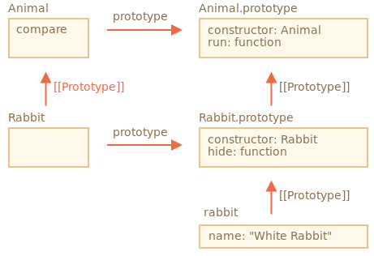

# 클래스의 정적 메소드, 프로퍼티

> 정적 메소드란? 
> 
> `prototype`가 아닌 클래스 함수 자체에 메소드 설정할 때, 해당 메소드.

```javascript
class User {
    static staticMethod(){
        console.log(this === User);
    }
}

User.staticMethod(); // true
```

정적 메소드는 메소드를 프로퍼티 형태로 직접 할당하는 것과 동일하게 동작한다.

```javascript
class User {}

User.staticMethod = function(){
    console.log(this === User);
}

User.staticMethod(); // true
```

`User.staticMethod()` 가 호출될 때 `this`의 값은 클래스 생성자인 `User` 자체가 된다.  
(`.` 앞 객체)

정적 메소드는 특정 객체가 아닌 클래스에 속한 함수를 구현할때 사용.

예를 들면 같은 클래스인 객체를 비교하는 메소드

```javascript
class Article {
  constructor(title, date) {
    this.title = title;
    this.date = date;
  }

  static compare(articleA, articleB) {
    return articleA.date - articleB.date;
  }
}
```

팩토리 메소드 예시

```javascript
class Article {
  constructor(title, date) {
    this.title = title;
    this.date = date;
  }

  static createTodays() {
    // this는 Article.
    return new this("Today's digest", new Date());
  }
}
```

## 정적 프로퍼티

정적 프로퍼티도 물론 만들 수 있다. 

정적 프로퍼티는 일반 클래스 프로퍼티와 유사하게 생겼는데 앞에 `static`이 붙는다는 점만 다르다.

```javascript
class Article {
    static publisher = "홍길동";
}

console.log(Article.publisher);
```
정적 메소드와 마찬가지로 프로퍼티를 직접 할당한것과 동일하게 동작한다.

```javascript
class Article {}

Article.publisher = "홍길동";
```

## 정적 프로퍼티와 메소드 상속

정적 프로퍼티와 메소드는 상속된다.

```javascript
class Animal {
    static planet = "지구";

    constructor(name, speed){
        this.name = name;
        this.speed = speed;
    }

    run(speed = 0){
        this.speed += speed;
        console.log(`${this.name} run ${this.speed}`);
    }

    static compare(animalA, animalB){
        return animalA.speed - animalB.speed;
    }
}

class Rabbit extends Animal {
    hide() {
        console.log(`${this.name} 숨음`);
    }    
}

let rabbits = [ new Rabbit("흰토끼", 10), new Rabbit("검은 토끼", 5) ];

rabbits.sort(Rabbit.compare);

rabbits[0].run();

console.log(Rabbit.planet);
```

`Rabbit`에서 `Animal`의 `compare`가 호출이 가능한 이유는 프로토타입 때문.

`extends` 키워드는 `Rabbit`의 `[[Prototype]]`이 `Animal`을 참조하도록 해준다.



`Rabbit extends Animal`은 두 개의 `[[Prototype]]` 참조를 만들어 낸다.

1. 함수 `Rabbit`은 프로토타입을 통해 함수 `Animal`을 상속받는다.
2. `Rabbit.prototype`은 프로토타입을 통해 `Animal.prototype`을 상속받는다.

이런 과정이 있기 때문에 일반 메소드 상속과 정적 메소드 상속이 가능하다.

# 정리

정적 메소드는 특정 클래스 인스턴스가 아닌 클래스 '전체’에 필요한 기능을 만들 때 사용할 수 있다.

인스턴스끼리 비교해주는 메소드나 팩토리 메소드를 만들 때 정적 메소드가 쓰인다.

정적 메소드는 클래스 선언부 안에 위치하고 앞에 `static`이라는 키워드가 붙습니다.

정적 프로퍼티는 데이터를 클래스 수준에 저장하고 싶을 때 사용한다. 

정적 프로퍼티 역시 개별 인스턴스에 묶이지 않는다.

```javascript
class SomeClass {
    static property = 'value';

    static staticMethod() {
        // ...
    }
}
```
위 코드와 아래 코드는 동일하게 동작

```javascript
class SomeClass {}

SomeClass.property = 'value';
SomeClass.method = function(){
    // ...
};
```

정적 프로퍼티와 메소드는 상속이 가능하다.