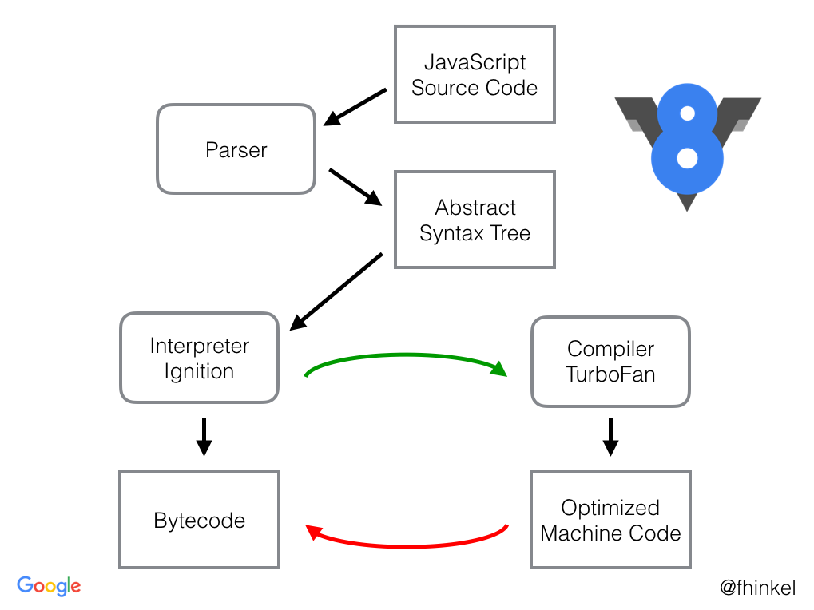

# 자바스크립트 엔진

대부분의 자바스크립트 관련 글들이 자바스크립트는 이런 저런 일들을 할 수 있고

문법은 이런 저런 식이다 라며 시작하는데, 자바스크립트가 어떻게 컴퓨터에서 처리되나

궁금해져서 찾아보았다.

컴퓨터에서 바로 작성된 자바스크립트 코드를 해석할 수 없기에

__자바스크립트 엔진__ 에 의해 해석된 바이트코드를 읽게 된다.

이 __자바스크립트 엔진__ 에는 여러 구현체들이 있지만, 가장 많이 쓰이는 대표적인 엔진

`V8` 엔진을 기반으로 알아보았다.

[다른 엔진](https://nodejs.dev/learn/the-v8-javascript-engine/#other-js-engines) 또한 존재 하나

굳이 깊게 찾아보진 않았다. 표준을 지키는 엔진이면 같은 결과값을 보장할 것이기에...

## 엔진 구조

1. `V8 엔진` 은 소스코드를 가져와 `Parser` 에게 소드 분석을 위임한다
2. `Parser` 는 소스 코드를
   분석하여 [`AST(Abstract Syntax Tree)`](https://ko.wikipedia.org/wiki/%EC%B6%94%EC%83%81_%EA%B5%AC%EB%AC%B8_%ED%8A%B8%EB%A6%AC)
   로 변환후 `Interpreter Ignition(점화기)`에게 바이트 코드 변환을 위임한다.
3. `Interpreter Ignition(점화기)` 자바스크립트를 `바이트 코드` 로 변환하는 인터프리터이다
4. 바이트 코드가 실행되며 소스코드가 작동되고 자주쓰는 코드는 `Compiler TurboFan`으로 보내서 `Optimized Machine Code(최적화된 머신코드)` 로
   다시 컴파일된다
    * `바이트코드(Bytecode, portable code, p-code)`는 특정 하드웨어가 아닌 가상 컴퓨터에서 돌아가는 실행 프로그램을 위한 이진 표현법이다.
      하드웨어가 아닌 소프트웨어에 의해 처리되기 때문에, 보통 기계어보다 더 추상적이다.
6. 덜 사용 되면 다시 `Deoptimzing` 하기도 한다
7. V8엔진의 기본 컨셉은 `Interpreter Ignition` 와 `Compiler TurboFan` 만을 이용하여 `바이트 코드` <-> `최적화 코드` 사이를 왔다가
   갔다 하는 것
    * 이런 최적화 기법 덕분에 자바스크립트도 충분히 성능을 내는게 가능해진다

---

# 참조

* [V8 엔진은 어떻게 내 코드를 실행하는 걸까?](https://evan-moon.github.io/2019/06/28/v8-analysis/)