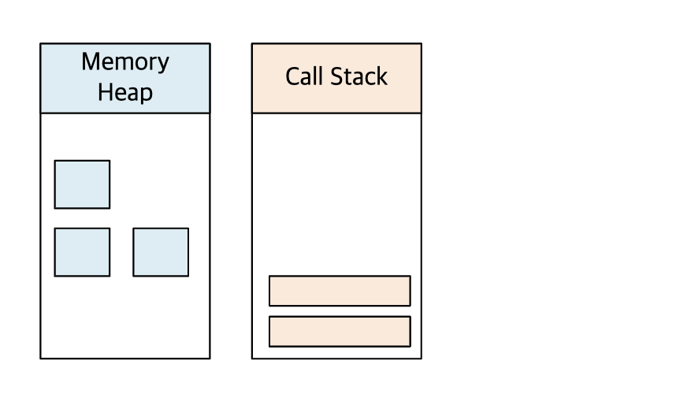
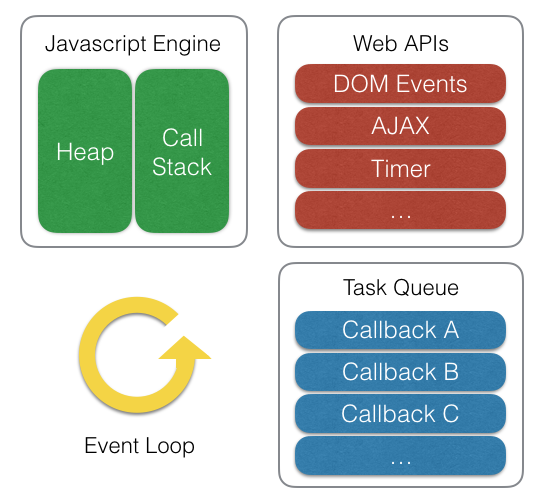
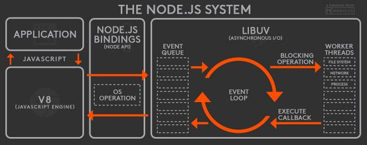
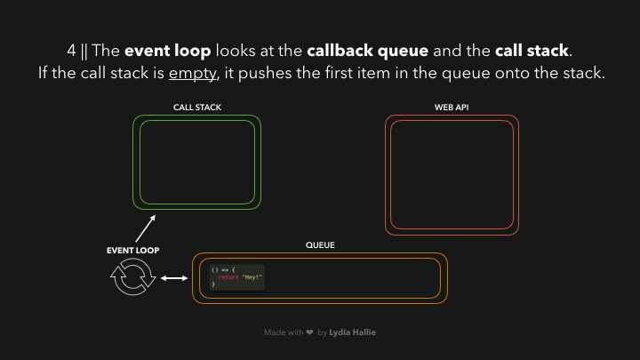

# Event Loop

자바스크립트는 싱글 스레드 기반 언어로

다른 멀티 스레드 지원하는 언어와 다르게 하나의 호출스택만을 가진다.

하나의 호출 스택만을 가진다는 뜻은 하나의 작업만 처리할 수 있다라고 볼 수 있는데

자바스크립트를 활용한 예시로 주변에서 쉽게 찾아볼 수 있는 브라우저를 보면

마치 동시에 처리되는 듯한 작업들을 볼 수 있다.

이 외에도 `Node.js`로 만들어진 웹 서버도 하나의 작업만 처리가 가능하다면

어떻게 많은 요청을 빠르게 처리할 수 있었을까?

브라우저 및 Node.js 에서는 `이벤트 루프` 기반의 비동기 방식으로 `Non-Blocking IO` 을 지원한다.

이 말은 즉, 자바스크립트는 이벤트 루프를 통해 비동기 방식으로 동시성을 지원한다는 말인데

대체 이벤트 루프가 무엇이길래 싱글 스레드 기반 언어인 자바스크립트에서

마치 동시에 여러일을 처리하는 것처럼 동작하게 만들까?

## 자바스크립트 엔진 구성 요소

이벤트 루프를 살펴보기 전에 자바 스크립트는 싱글 스레드 기반 언어라고 했는데

해당 요소를 잘 나타내는 자바스크립트 엔진에 대해 다시 한번 집고 넘어가자

상세한 내용은 [엔진](/javascript/engine/README.md) 를 통해 살펴보자

자바스크립트 엔진은 크게 두가지 영역으로 나뉘는데, 내용은 아래와 같다

* `Heap`
    * 메모리 할당이 이뤄지는 영역
* `Call Stack`
    * 코드 실행에 따른 호출스택이 쌓이는 영역

## 런타임 환경

자바스크립트 엔진에서는 앞서 말한 `이벤트 루프` 관련 내용이 없다.

그렇다면 어디서 해당 내용을 찾을 수 있을까?

해당 내용은 단순하게 `실행하는 환경`에서 `이벤트 루프`를 지원한다.

즉, 브라우저 혹은 Node.js에서 이벤트 루프를 지원한다.

위의 그림은 브라우저의 자바스크립트 실행 환경을 나타낸다.

브라우저 환경에서 비동기 호출을 사용하는 함수들은 자바스크립트 엔진이 아닌 `Web API`영역에 정의되어 있다.

이벤트 루프와 테스크 큐와 같은 장치도 엔진 외부에 구현이 되어 있다.

위 그림은 Node.js 환경을 그림으로 나타낸것이다.

브라우저와 비슷한 구조를 가지고 있으며,

차이점은 Node.js의 경우 비동기 IO를 지원하기 위해 libuv 라이브러리를 사용하며,

해당 라이브러리를 통해 이벤트 루프를 제공하고 있다.

이러한 내용을 통해 위에서 나온 궁금증인

싱글 스레드 기반 언어인 자바스크립트가 어떻게 동시에 여러일을 하는 것처럼 처리할까?

에 대한 답을 알아볼 수 있다.

실제로 자바스크립트가 구동되는 런타임 환경(브라우저, Node.js 등) 환경에서

주로 여러 쓰레드가 사용되며, 이러한 구동 환경이 자바스크립트 엔진과 상호 연동하기 위해

이벤트 루프를 통해 제공된다.

## 이벤트 루프

이벤트 루프에 대해 좀 더 알아보자

이벤트 루프는 하나의 단순한 동작만을 수행한다.

`Call Stack`과 `Task Queue`를 감시하면서,

`Call Stack`이 비어 있다면

이벤트 루프는 큐에서 첫 번째 `Task`를 호출스택에 넣어 해당 `Task`가 실행되게 한다.

이러한 동작을 이벤트 루프에서는 `tick`이라고 부른다.

실제 처리되는 내용은 실행 엔진의 `Call Stack`에 올라간 `Task`가 실행되며

자바스크립트 함수는 보통 `Run-to-Completion` 방식으로 실행되는데

이는 하나의 함수가 실행되면 해당 함수가 종료될때까지 다른 작업도 끼어들지 못한다.

한마디로 해당 함수가 실행되면 완료되어야 다른 작업을 할 수 있다 라는 것.

## 마무리

자바스크립트 비동기 관련 내용을 찾다가

제대로 정리가 안되고 막연히

"아, 자바스크립트는 싱글 스레드이고 생산성 및 체감 성능 향상을 위해 적극적으로 비동기 로직을 쓰는구나."

라고만 이해하고 있었는데, 그 비동기 로직을 어떤 방식으로 사용되는지 알아보다

해당 내용을 이벤트 루프라는 구조를 통해, 처리되고 있다는 걸 찾아

해당 내용을 공부할겸, 적어보았다.

---

# 참고

* [자바스크립트와 이벤트 루프](https://meetup.toast.com/posts/89)
* [JavaScript Visualized: Event Loop](https://dev.to/lydiahallie/javascript-visualized-event-loop-3dif)
* [Node.js 이벤트 루프, 타이머, process.nextTick()](https://nodejs.org/ko/docs/guides/event-loop-timers-and-nexttick/)