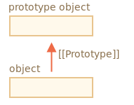

# 프로토타입

자바스크립트에서 `상속`을 `프로토타입 상속(prototypal inheritance)`를 통해 구현할 수 있다.

## [[Prototype]]

자바스크립트의 오브젝트는 명세서에서  
명명한 `[[Prototype]]`이라는 숨김 프로퍼티를 갖습니다. 

이 숨김 프로퍼티 값은 `null`이거나 다른 객체에 대한 참조가되는데, 

다른 객체를 참조하는 경우 참조 대상을 `프로토타입(prototype)`이라 부릅니다.



프로토타입의 동작 방식은 `신비스러운`면이 있습니다. 

`object`에서 프로퍼티를 읽으려고 하는데 해당 프로퍼티가 없으면 

자바스크립트는 자동으로 프로토타입에서 프로퍼티를 찾기 때문이죠. 

프로그래밍에선 이런 동작 방식을 `프로토타입 상속`이라 부릅니다. 

언어 차원에서 지원하는 편리한 기능이나 개발 테크닉 중 프로토타입 상속에 기반해 만들어진 것들이 많습니다.

`[[Prototype]]` 프로퍼티는 내부 프로퍼티이면서 숨김 프로퍼티이지만 다양한 방법을 사용해 개발자가 값을 설정할 수 있습니다.

```javascript
let animal = {
  eats: true
};
let rabbit = {
  jumps: true
};

rabbit.__proto__ = animal;
```

프로토타입 체이닝엔 두 가지 제약사항이 있습니다.

순환 참조(`circular reference`)는 허용되지 않습니다.

`__proto__`를 이용해 닫힌 형태로 다른 오브젝트를 참조하면 에러가 발생합니다.

`__proto__`의 값은 오브젝트나 `null`만 가능합니다. 다른 자료형은 무시됩니다.

여기에 더하여 오브젝트엔 오직 하나의 `[[Portotype]]`만 있을 수 있다는 

당연한 제약도 있습니다. 오브젝트는 두 개의 오브젝트를 상속받지 못합니다.

### `__proto__`

`__proto__`는 `[[Prototype]]`용 `getter`·`setter`입니다.

`__proto__`는 `[[Prototype]]`과 다릅니다. 

`__proto__`는 `[[Prototype]]`의 `getter`이자 `setter` 입니다.

하위 호환성 때문에 여전히 `__proto__`를 사용할 순 있지만 

비교적 근래에 작성된 스크립트에선 `__proto__` 대신 

함수 `Object.getPrototypeOf`나 `Object.setPrototypeOf`을 써서 

프로토타입을 획득하거나 설정합니다. 

### 쓸 때는 프로토타입을 사용하지 않습니다.

프로토타입은 프로퍼티를 읽을 때만 사용합니다.

프로퍼티를 추가, 수정하거나 지우는 연산은 오브젝트에 직접 해야 합니다.

### `this`

`this`는 프로토타입에 영향을 받지 않습니다.

메서드를 오브젝트에서 호출했든 프로토타입에서 호출했든 상관없이 

**`this`는 언제나 `.` 앞에 있는 객체가 됩니다.**

### for...in 반복문

`for..in` 반복문은 상속 프로퍼티도 순회대상에 포함된다.

`obj.hasOwnProperty(key)`를 이용하면  
상속 프로퍼티를 순회 대상에서 제외할 수 있습니다. 

이 내장 메서드는 `key`에 대응하는 프로퍼티가 상속 프로퍼티가 아니고 

`obj`에 직접 구현되어있는 프로퍼티일 때 `true`를 반환합니다.

> **키-값을 순회하는 메서드 대부분은 상속 프로퍼티를 제외하고 동작합니다.**
> `Object.keys`, `Object.values` 같이 객체의 키-값을 대상으로 무언가를 하는 메서드 대부분은 상속 프로퍼티를 제외하고 동작합니다.
> 
> 프로토타입에서 상속받은 프로퍼티는 제외하고, 해당 객체에서 정의한 프로퍼티만 연산 대상에 포함합니다.

# 정리

* 자바스크립트의 모든 객체엔 숨김 프로퍼티 `[[Prototype]]`이 있는데,  
  이 프로퍼티는 객체나 `null`을 가리킵니다.
* `obj.__proto__`를 사용하면 프로토타입에 접근할 수 있습니다. 
  * `__proto__`는 `[[Prototype]]`의 `getter·setter`로 쓰이는데
    * **요즘엔 잘 쓰지 않습니다.**
* `[[Prototype]]`이 참조하는 객체를 `프로토타입`이라고 합니다.
* `obj`에서 프로퍼티를 읽거나 메서드를 호출하려는데  
  해당하는 **프로퍼티나 메서드가 없으면**  
  자바스크립트는 **프로토타입에서 프로퍼티나 메서드를 찾습니다.**
* 접근자 프로퍼티가 아닌 데이터 프로퍼티를 다루고 있다면,  
  쓰기나 지우기와 관련 연산은 프로토타입을 통하지 않고 객체에 직접 적용됩니다.
* 프로토타입에서 상속받은 `method`라도 `obj.method()`를 호출하면  
  `method` 안의 `this`는 호출 대상 객체인 `obj`를 가리킵니다.
* `for..in` 반복문은 객체 자체에서  
  정의한 프로퍼티뿐만 아니라 상속 프로퍼티도 순회 대상에 포함합니다. 
  반면, 키-값과 관련된 내장 메서드 대부분은 상속 프로퍼티는 제외하고  
  객체 자체 프로퍼티만을 대상으로 동작합니다.