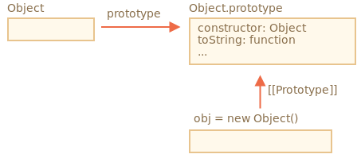
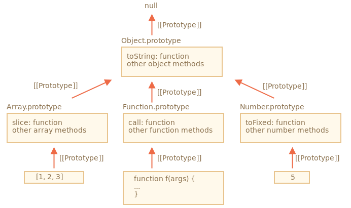

# 네이티브 프로토타입

`prototype` 프로퍼티는 자바스크립트 내부에서도 광범위하게 사용한다. 

모든 내장 생성자 함수에서 `prototype` 프로퍼티를 사용됨.

## `Object.prototype`

```javascript
let obj = {};

console.log(obj); // [object Object]
```

이 코드에서 출력되는 `[object Object]` 문자열은 어디서 생성될까?

`toString` 메소드로 생성되는 것은 알겠지만, 비어있는 오브젝트에서 결과가 왜 이렇게 나올까?

`let obj = {}`는 `let obj = new Object()`와 같은 코드다.

여기서 `Object`는 내장 오브젝트의 생성자 함수인데,

이 생성자 함수의 `prototype`은 `toString`을 비롯한 다양한 메소드가 구현된 거대한 객체를 참조한다.

`new Object()`를 호출하거나 리터럴 문법 `{...}`을 통해 객체를 만들때

새롭게 생성된 객체의 `[[Prototype]]`은 `Object.prototype`을 참조한다.



따라서 `obj.toString()`을 호출하면 `Object.prototype`에서 해당 메소드를 가져오게 된다.

```javascript
let obj = {};

console.log(obj.__proto__ === Object.prototype); // true

console.log(obj.toString === obj.__proto__.toString); //true
console.log(obj.toString === Object.prototype.toString); //**true**
```

이때 `Object.prototype` 위의 체인엔 `[[Prototype]]`이 없다는 점을 주의

```javascript
console.log(Object.prototype.__proto__); // null
```

## 다른 내장 프로토타입

`Array`, `Date`, `Function`을 비롯한 내장 객체들 역시 프로토타입에 메서드를 저장해 놓는다.

배열 `[1, 2, 3]`을 만들면 기본 `new Array()` 생성자가 내부에서 사용되기 때문에 `Array.prototype`이 배열 `[1, 2, 3]`의 프로토타입이 된다.

`Array.prototype`은 배열 메서드도 제공한다. 

이런 내부 동작은 메모리 효율을 높여주는 장점을 가져다준다.

명세서에선 모든 내장 프로토타입의 꼭대기엔 `Object.prototype`이 있어야 한다고 규정한다. 

이런 규정 때문에 몇몇 사람들은 `"모든 것은 객체를 상속받는다."`라는 말을 한다.

세 개의 내장 객체를 이용해 전체적인 그림을 그리면 다음과 같다.



```javascript
let arr = [1, 2, 3];

// arr은 Array.prototype을 상속받았나요?
console.log( arr.__proto__ === Array.prototype ); // true

// arr은 Object.prototype을 상속받았나요?
console.log( arr.__proto__.__proto__ === Object.prototype ); // true

// 체인 맨 위엔 null이 있습니다.
console.log( arr.__proto__.__proto__.__proto__ ); // null
```

체인 상의 프로토타입엔 중복 메서드가 있을 수 있다. 

`Array.prototype`엔 요소 사이에 쉼표를 넣어 요소 전체를 합친 문자열을 반환하는 자체 메서드 `toString`가 있다.

그런데 `Object.prototype`에도 메서드 `toString`이 있다. 

이렇게 중복 메서드가 있을 때는 체인 상에서 가까운 곳에 있는 메서드가 사용된다. 

`Array.prototype`이 체인 상에서 더 가깝기 때문에 `Array.prototype`의 `toString`이 사용.

`console.dir`를 사용하면 내장 객체의 상속 관계를 확인하는 데 도움이 된다.

## Primitive Value

`Primitive` , 원시값인 문자열과 숫자 불린값을 다루는 것은 엄청 까다롭다.

**문자열과 숫자 불린값은 객체가 아닙니다.** 

그런데 이런 원시값들의 프로퍼티에 접근하려고 하면 내장 생성자 `String`, `Number`, `Boolean`을 사용하는 임시 래퍼(`wrapper`) 객체가 생성된다. 

임시 래퍼 객체는 이런 메서드를 제공하고 난 후에 사라진다.

래퍼 객체는 보이지 않는 곳에서 만들어진다. 최적화는 엔진이 담당한다. 

그런데 명세서에선 각 자료형에 해당하는 래퍼 객체의 메서드를 프로토타입 안에 구현해 놓고 `String.prototype`, `Number.prototype`, `Boolean.prototype`을 사용해 쓸 수 있도록 규정한다.


> `null`과 `undefined`에 대응하는 래퍼 객체는 없습니다.
>
> 특수 값인 `null`과 undefined는 문자열과 숫자 불린값과는 거리가 있습니다. 
> 
> `null`과 `undefined`에 대응하는 래퍼 객체는 없죠. 
> 
> 따라서 `null`과 `undefined`에선 메서드와 프로퍼티를 이용할 수 없습니다.
>  
> 프로토타입도 물론 사용할 수 없습니다.

### 네이티브 프로토타입 변경

네이티브 프로토타입을 수정할 수 있다.

`String.prototype`에 메서드를 하나 추가하면 모든 문자열에서 해당 메서드를 사용할 수 있다.

```javascript
String.prototype.show = function() {
    console.log(this);
};

"STRING!".show() ; // STRING!
```

> 프로토타입은 전역으로 영향을 미치기 때문에 
> 
> 프로토타입을 조작하면 충돌이 날 가능성이 높습니다. 
> 
> 두 라이브러리에서 동시에 `String.prototype.show` 메서드를 추가하면 
> 
> 한 라이브러리의 메서드가 다른 라이브러리의 메서드를 덮어쓰죠.
>
> 이런 이유로 네이티브 프로토타입을 수정하는 것을 추천하지 않습니다.

**모던 프로그래밍에서 네이티브 프로토타입 변경을 허용하는 경우는 딱 하나뿐입니다. 바로 폴리필을 만들 때입니다.**

## 프로토타입에서 빌려오기

개발을 하다 보면 네이티브 프로토타입에 구현된 메서드를 빌려야 하는 경우가 종종 생깁니다.

```javascript
let obj = {
  0: "Hello",
  1: "world!",
  length: 2,
};

obj.join = Array.prototype.join;

console.log( obj.join(',') ); // Hello,world!
```

예시를 실행하면 에러 없이 의도한 대로 동작합니다. 

내장 메서드 `join`의 내부 알고리즘은 

1. 제대로 된 인덱스가 있는지
2. length 프로퍼티가 있는지 
 
만 확인하기 때문에. 

다수의 내장 메서드가 이런 식으로 호출 대상이 진짜 배열인지 아닌지 확인하지 않는다.

메서드 빌리기 말고도 `obj.__proto__`를 `Array.prototype`로 설정해

배열 메서드를 상속받는 방법이 있다. 

이렇게 하면 `obj`에서 모든 `Array`메서드를 사용할 수 있다.

그런데 이 방법은 `obj`가 다른 객체를 상속받고 있을 때는 사용할 수 없다. 

자바스크립트는 단일 상속만을 허용한다는 점을 기억!

메서드 빌리기는 유연하다. 

여러 객체에서 필요한 기능을 가져와 섞는 것을 가능하게 해준다.

# 정리

* 모든 내장 객체는 같은 패턴을 따른다.
  * 메서드는 프로토타입에 저장됩니다  
  (`Array.prototype`, `Object.prototype`, `Date.prototype` 등).
  * 객체 자체엔 데이터만 저장한다  
  (배열의 요소, 객체의 프로퍼티, 날짜 등).
* 원시값 또한 래퍼 객체의 프로토타입에  
``Number.prototype`, ``String.prototype`, `Boolean.prototype` 같은 메서드를 저장한다.   
`undefined`와 `null` 값은 래퍼 객체를 가지지 않는다.
* 내장 프로토타입을 수정할 수 있다.   
내장 프로토타입의 메서드를 빌려와 새로운 메서드를 만드는 것 역시 가능하다.  
그러나 내장 프로토타입 변경은 되도록 하지 않아야 한다.  
내장 프로토타입은 새로 명세서에 등록된 기능을 사용하고 싶은데 자바스크립트 엔진엔 이 기능이 구현되어있지 않을 때만 변경하는 게 좋다.